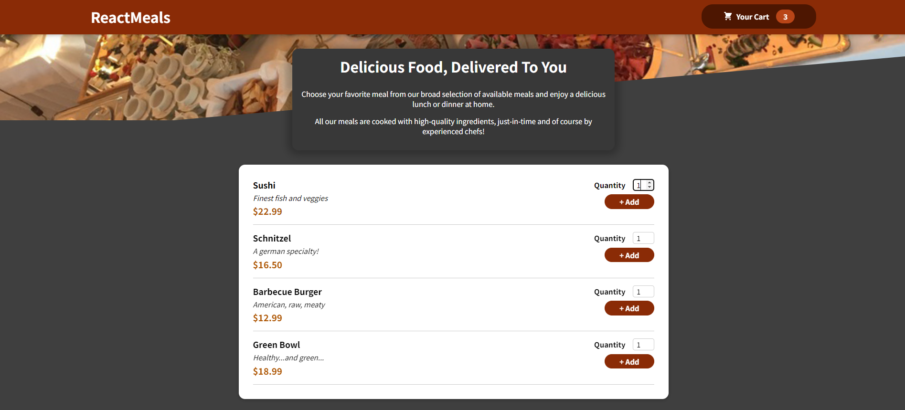

# 🍝 ReactMeals: The Food Ordering App

Welcome to the ReactMeals Food Ordering App! This web application, built with React.js, lets users explore an Italian menu, add items to their cart, and seamlessly place orders. The user interface boasts a sleek design with a responsive layout. The cart feature is enhanced with a delightful bump effect.



## Live Demo

Check out the live demo [here](https://food-meals-order.netlify.app/).

## Features

- **🍕 Italian Menu Display:** Explore a variety of delicious Italian dishes.
- **🛒 Cart Functionality:** Add items to the cart and view the added items in a beautifully designed modal.
- **🎉 Bump Effect:** Enjoy a visually appealing bump effect on the cart button.
- **📦 Order Placement:** Easily place orders with a user-friendly interface.

## Getting Started

To run this project locally, follow these steps:

1. **Clone the repository:**

    ```bash
    git clone https://github.com/rishii-27/ReactRestaurantApp.git
    ```

2. **Navigate to the project directory:**

    ```bash
    cd ReactRestaurantApp
    ```

3. **Install dependencies:**

    ```bash
    npm install
    ```

4. **Start the development server:**

    ```bash
    npm start
    ```

5. **Open your browser and visit** [http://localhost:3000](http://localhost:3000) **to view the app.**
